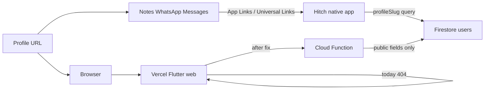

# Browser fallback for profile deep links

## Verdict

Yes, this is achievable. Messaging apps open Hitch via App Links; the browser hits Vercel and gets **404** because there is no file/route for paths like `/pickleball-partners/player/...`. The live host is [hitch_profile_slug_deeplink](/Users/sheraz-ali/StudioProjects/hitch_profile_slug_deeplink) (Flutter web on Vercel), not the Hitch app repo.

## Root cause

- Domain `links.hitchplayerfinder.com` serves the Flutter build from `hitch_profile_slug_deeplink`.
- `/` works (stub home page). Deep paths have **no static file** and **no `vercel.json` rewrite**, so Vercel returns `404: NOT_FOUND`.
- Even after a rewrite, [lib/main.dart](/Users/sheraz-ali/StudioProjects/hitch_profile_slug_deeplink/lib/main.dart) ignores the path and does not load a player.
- Native Hitch only needs the last path segment (`thomas-jp`) via [`ProfileDeepLinkHandler.extractProfileSlug`](/Users/sheraz-ali/StudioProjects/hitch/lib/src/dynamic_link/dynamic_link_handler.dart) and queries Firestore `users.where('profileSlug' == slug)`.

## Approach (locked)

Work in **`hitch_profile_slug_deeplink`** + a small **HTTP Cloud Function** on Firebase project `hitches-mobile-app` (extend [hitch_assign_profileslug](/Users/sheraz-ali/Documents/cloud_functions/hitch_assign_profileslug), which already uses Admin SDK against `users` / `profileSlug`).

Do **not** query full user docs from the browser (would expose email, phone, tokens). The API returns only public fields.

### 1. Stop the Vercel 404

Add [`vercel.json`](/Users/sheraz-ali/StudioProjects/hitch_profile_slug_deeplink/vercel.json):

- Rewrite all non-file routes to `/index.html` (Flutter SPA).
- Keep serving static `.well-known/*` as-is so App Links keep working.
- Ensure AASA is served with `Content-Type: application/json` (currently can 500 / mis-serve).

Deploy output remains `build/web` from `flutter build web`.

### 2. Public profile API

In `hitch_assign_profileslug/functions/index.js`, add `getPublicProfileBySlug` (`onRequest`):

- Input: `?slug=thomas-jp` (or path param).
- Query: `users` where `profileSlug == slug`, limit 1.
- Response (public only): `userName`, `profileSlug`, `profilePicture`, sport flags, level / DUPR display fields, `bio`, city from `locationStringArray`, maybe sports photos URLs.
- Omit: `emailAddress`, `cellNumber`, `token`, request IDs, lat/lng precision if sensitive, etc.
- `404` if not found; enable CORS for `links.hitchplayerfinder.com`.

### 3. Flutter web profile page

In `hitch_profile_slug_deeplink`:

- Parse `Uri.base` with the same slug rules as the native app (short `/player/{slug}` and long `.../player/.../{slug}` → last segment).
- Call the Cloud Function; show loading / not-found / profile states.
- UI (public card, Hitch green `#90B953`): photo, name, sports, level/rating, city, bio.
- CTAs:
  - **Open in Hitch** — same HTTPS URL (mobile + app installed → native deep link).
  - **Get the app** — App Store / Play Store links (confirm exact URLs during implementation; placeholder OK until provided).

Wire routing so `/` stays a simple Hitch landing, and player paths render the profile screen.

### 4. Preserve deep-link files

Do not change path coverage in [web/.well-known/apple-app-site-association](/Users/sheraz-ali/StudioProjects/hitch_profile_slug_deeplink/web/.well-known/apple-app-site-association) / `assetlinks.json` beyond fixing headers/serving. Native Hitch app code does not need changes for the browser fallback.

### 5. Deploy + verify

1. Deploy Cloud Function to `hitches-mobile-app`.
2. `flutter build web` → deploy to Vercel project `hitch_profile_slug_deeplink`.
3. Verify:
   - Browser: `.../pickleball-partners/player/ottawa/3.0-3.99-dupr/thomas-jp` shows player (not 404).
   - Browser: `/player/{slug}` works.
   - `.well-known/assetlinks.json` and AASA still load.
   - Opening the same URL from Messages/WhatsApp still opens the native app.

## Out of scope

- Full in-app `UserInfoPage` parity (chat, hitch requests, report).
- Changing share URL format in the main Hitch app.
- Dynamic OG/Twitter meta per player (needs SSR; can be a follow-up).
